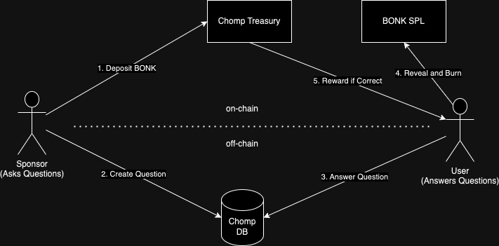
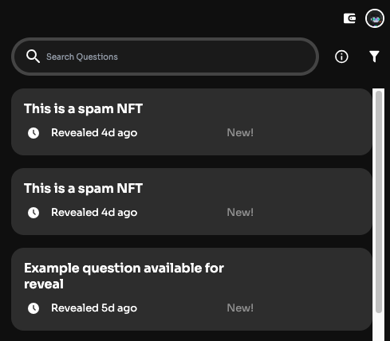
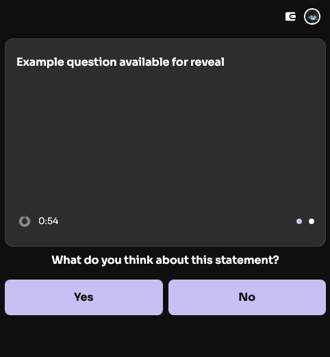
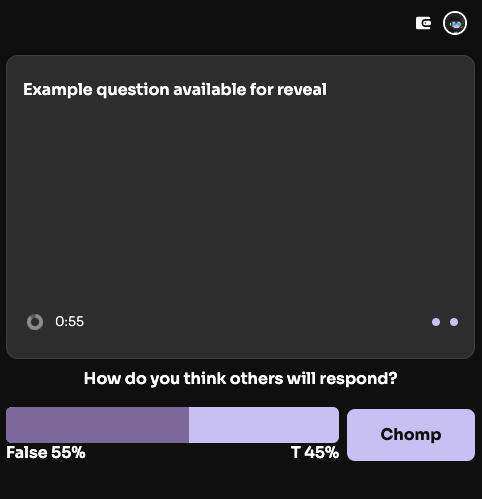
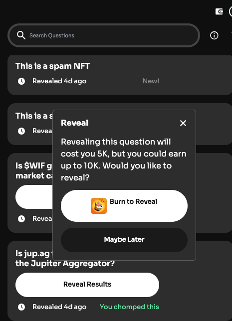
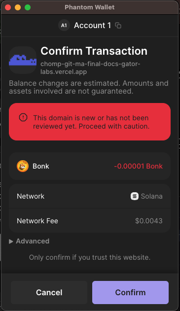

# Chomp

Chomp, a gamified social consensus platform that gets you best-in-class insights.

For the user, it's a fast-play quiz, polling or trivia game that gets you the most likely answers to a question. Under the hood, we implement a set of social consensus mechanisms adapted from empirical research around the wisdom of the crowd problem. Through first giving your own answer, and then your perception of others’ answer to the same question, we can obtain the true state of the world, even when most players of the game do not know what that true state is.

Chomp is the first mini-game product created by Gator Labs. We intend to build out more gamified applications that feed into Gator's underlying reputation graph and data layer, which would be composable with businesses looking to build with a reputation graph or highly accurate information that benefits their end users.

## Deployment details

- [Live Demo](https://gator-chomp.vercel.app/)
- [Frame API](https://chomp-frame.vercel.app/api)
- [Frame Demo](https://warpcast.com/~/developers/frames?url=https%3A%2F%2Fchomp-frame.vercel.app%2Fapi) (Warpcast login required)
- [Frame Code](https://github.com/gator-labs/chomp-frame)
- [ChompBot](https://github.com/gator-labs/chomp-bot)

## Getting started

Prerequisites:

- Install Docker
- Create a [Dynamic](https://www.dynamic.xyz/) account
- Solana RPC like Helius

```sh
# install dependencies
$ yarn

# setup environment variables
$ cp .env.example .env.local

# start DB
$ yarn compose:db:up

# run migrations
$ yarn prisma:migrate

# start the app
$ yarn dev
```

## How Chomp works

Chomp takes your responses of the 1st Order Question (your response to the statement/question), and the 2nd Order Question (your perceived sentiment of how others would respond to the statement/question), and puts them through Gator's novel mechanism that infer the most likely right answer of the question.

Chomp's mechanism is driven by empirical research around the "[Wisdom of the Crowd](https://arxiv.org/pdf/2102.02666.pdf)" problem. We are adapting this mechanism for several question formats and rolling them out gradually on Chomp

The components of Chomp include:

- Next JS dapp frontend
- Dynamic Wallet for auth and signing
- Integrated with SPL for token transfers and burning
- Farcaster Frame built with Frog.fm

### User journey

Chomp is two sided, including people who ask questions and people who answer questions. Question askers are often representing a company that wants to engage the public with their brand. Question answerers are often regular people with some amount of knowledge.

1. Question asker deposits capital to fund engagement rewards
2. Question asker asks questions
3. Question answerer answers one or more questions
4. At some point in the future, the question answer can be revealed after burning $BONK
5. User rewarded if they got the answer correct



### Wisdom of the Crowd

This is the code used in the "Suprisingly Popular" algorithm underlying our current prediction algorithm:

```py
def get_SP_answer_binary(first_order_percent_A, first_order_percent_B, second_order_percent_A, second_order_percent_B):

    a = first_order_percent_A - second_order_percent_A
    b = first_order_percent_B - second_order_percent_B

    if a > b:
        answer = 'A'
    elif b > a:
        answer = 'B'
    else:
        answer = 'Tie'

    return answer
```

We are in the process of adapting another set of "[Wisdom of the Crowd](https://arxiv.org/pdf/2102.02666.pdf)" mechanisms for multiple-choice questions.

## Roadmap/next steps:

We will be doing a closed alpha in Dubai next week with FOMO Mag + MonkeDAO, and then an open beta through DRiP in mid-May. Q2+Q3 are all about experimentation and validation, where we will aim to understand our users better, hone in on a few use cases, improve product features, and gather enough data to improve on our mechanism and tokenomics design.

On the technical front:

- Finish off the UI for the dapp.
- The BONK transfer and burn values are currently hardcoded and not tied to the database.
- Add multi-token support.
- Implement more complex scoring mechanisms from Wisdom of the Crowd.

## Testing

SPL token interaction is thoroughly tested for transfer and burn correctness. [Bankrun](https://github.com/kevinheavey/solana-bankrun/tree/main) is used for testing on-chain transactions. See `__tests__` for code.

```sh
# Setup test environment
cp .env.example .env.test

# Run tests
yarn test
```

## Using the app

1. Browse open questions



2. Select a question and submit first order answer



3. Select a question and submit second order answer



4. Reveal to start Bonk burn



5. Burn bonk to reveal



## Demo environment

Demo environment is used for testing flow of application in easy and repeatable
way so users can see how app works before using production version. Only feature
that differentiates demo from production environment is Reset data button in
Profile section that allows user to reset all changes made to demo profile like
answers to questions, question reveals and claims.

Data in demo environment is composed of 3 questions in daily deck that user can
answer when they open app and 3 answered questions that user is able to reveal
from home or history page. Daily deck can be set up from admin dashboard in the
same way as on production app and small change is made to the backend to disable
that daily deck expiring on demo environment.

For setting up answered questions, the process is a bit more difficult. We first
need to add records in `Question` and `QuestionOption` tables that contain
question and option data (note that reveal date has to be in past so users can
reveal those question immediately). After that, pre made user's answer records
need to be added to `QuestionAnswer` table. Note that all demo answer records
can be set to dummy account, in this case I've set up user with id `app` in
`User` table that owns all of the answers.

Demo environment is accessible on [app-demo.chomp.games](https://app-demo.chomp.games/).

### Deploying new environments

- [ ] Enable workflow migrations in `.github/workflows/migrations.yml`
- [ ] Create DB in Vercel Storage
- [ ] Add `DATABASE_PRISMA_URL_{ENVIRONMENT}` and `DATABASE_URL_NON_POOLING_{ENVIRONMENT}` to Github
